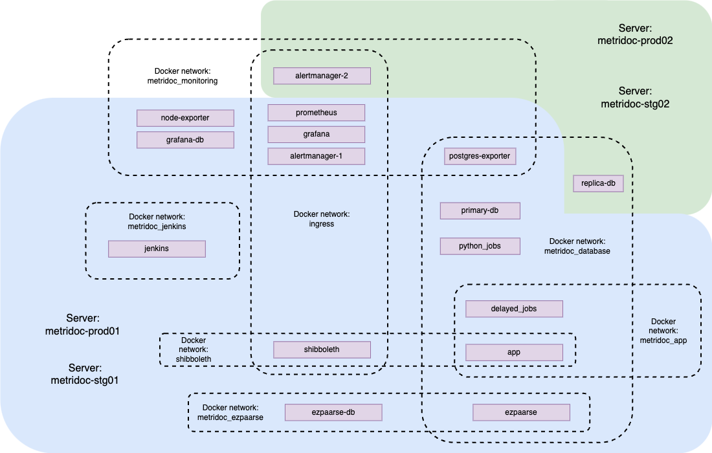

# Metridoc

Metridoc is a web application whose purpose is to view and maintain library statistics/reports. It provides tools for data collection from a variety sources. Metridoc seeks to improve business intelligence in libraries by making data available in a normalized and resolved form, in a repository that supports analysis and use of visualization tools. Visit https://metridoc.library.upenn.edu/ to see the application.

## 1. Application Information

Metridoc is a Docker Swarm microservice web application made up of the docker services listed below:

| Service Name | Purpose  |
| ---          | ---      |
| app     | The primary app, built with Ruby on Rails.  |
| primary-db       | Primary database used by app service. Postgres database.   |
| replica-db       | Replica database used by app service. Postgres database.        |
| delayed_jobs |  Handles user uploaded data and updates the primary database. |
| python_jobs | Python scripts that handles more data ingestion from various sources. Used only on by devs/administrators, not end-users.  |
| shibboleth | UPenn's SSO service |
| ezpaarse | an external service we forked. Used to ingest/process proxy logs. Accesses proxy logs dumped into asg02 file share. Visit https://github.com/ezpaarse-project/ezpaarse |
| ezpaarse_db | an external service required by ezpaarse service. MongoDB instance. |
| jenkins | Job manager used to schedule cron tasks to import data and run ezpaarse. |
| prometheus | Open-source third-party monitoring. Used to send alerts. Visit https://hub.docker.com/r/prom/prometheus for more info.  |
| alertmanager-1 | The Alertmanager handles alerts sent by client applications such as the Prometheus server. It takes care of deduplicating, grouping, and routing them to the correct receiver integrations⁠ such as email, PagerDuty, OpsGenie, or many other mechanisms⁠ thanks to the webhook receiver. It also takes care of silencing and inhibition of alerts. Visit https://hub.docker.com/r/prom/alertmanager for more info. |
| alertmanager-2 | Same as alertmanager-1. |
| grafana | The open-source platform for monitoring and observability. Visit https://github.com/grafana/grafana for more info. | 
| grafana-db | Postgres db required by Grafana.  |
| node-exporter | Prometheus exporter for hardware and OS metrics exposed by *NIX kernels, written in Go with pluggable metric collectors. Visit https://hub.docker.com/r/prom/node-exporter for more info. |
| postgres-exporter | Prometheus exporter for sending postgres information. Visit https://github.com/prometheus-community/postgres_exporter for more info. |


## 2. Infrastructure Information

Metridoc is a Docker Swarm application made up of two nodes. The application services are split up between these nodes for healthchecks and fault tolerance. Infrastructure is automated via Terraform in a separate repository. See https://gitlab.library.upenn.edu/core-services/infra/metridoc. Deployment of the application happens via Gitlab pipeline and Ansible playbooks.

Production nodes: metridoc-prod01 & metridoc-prod02
Staging nodes: metridoc-stg01 & metridoc-stg02



### 2.1 Local Infrastructure

We use Vagrant to create a local virtual machine that the Metridoc Docker Swarm lives on. There is only one manager node and there is also an NGINX reverse proxy service responsible for directing traffic into the application.


### 3. External Data Dependencies

Metridoc depends on external data sources. API requests, queries, and data migrations are frequently run. Check out https://upennlibrary.atlassian.net/wiki/spaces/IAOA/pages/1243938829/All+Things+MetriDoc for more information.

## 4. Getting Started with Local Development

To get started:

1. Install Vagrant
2. If your machine is an ARM machine (Mac M1, M2, etc.) then download Parallels, otherwise download VirtualBox. A license will be required, contact Betsy Deming for assistance.
3. `cd` to the vagrant directory in the project repo.
4. Run `vagrant up --provision` to spin up the application.
5. Congratulations! You can now start developing!

To reload Vagrant (restart Vagrant machine and load new Vagrantfile config):
1. Run `vagrant reload --provision`

To restart Vagrant from scratch:
1. Run `vagrant destroy -f`
2. Delete the .vagrant directory in the project repo.

To access the Vagrant virtual machine:
1. Run `vagrant ssh`
2. From here, you can run docker commands as usual.

### 5. Developing

#### 5.1 Load a DB snapshot to staging

The staging DB is also being used by the prototype Production environment, and privileges need to be reestablished after each load:
cd ~/application/current/ && RAILS_ENV=staging rake db:environment:set db:drop db:create # update this next line with your snapshot timestamp
time gunzip -c ~/metridoc_development_2018-12-25_10-52-18.sql.gz | sudo -u postgres psql metridoc_staging

    # This should work but doesn't. Not sure why: echo "GRANT ALL PRIVILEGES ON ALL TABLES IN SCHEMA public TO serano;" | sudo -u postgres psql
    # So we do this instead
    echo "\dt;" | sudo -u postgres psql metridoc_staging | tail -n +4 | awk '{print $3}' > /tmp/tables.txt
    for i in `cat /tmp/tables.txt`; do echo "GRANT ALL PRIVILEGES ON $i TO serano;" | sudo -u postgres psql metridoc_staging; done

#### 5.2 Importing data

There are two data source types planned at the moment, import:csv and import:mysql.
When importing CSV data, you will need the (full or relative) path to a folder containing all CSVs to be imported.

#### 5.3 CSV:Keyserver

First, generate a migration from the CSV files:
(NOTE it would be preferable for this rake task to create the migration file itself,
but I couldn't find the Rails code to reuse, and didn't want to reinvent it)

    rake generate migration create_keyserver_tables
    rake import:csv:generate_migration_params[/path/to/csv/files] > db/migrate/TIMESTAMP_create_keyserver_tables.rb
    rake db:migrate

After schema is loaded, do the necessary data converting to fix encoding of Programs.csv and changing 'No Asset Information' to nil in Computers.csv:

    rake import:csv:convert[/path/to/csv/files]

After data conversions, invoke the importer task:

    rake import:csv:keyserver[/path/to/csv/files]

#### 5.4 MySql:borrowdirect

To generate schema for borrowdirect mysql database, first `config/database_borrrowdirect.yml` needs to be created with connection properties.

Then need to generate an empty migration file to store borrowdirect migration script:

    rails g migration import-borrowdirect

Run the following to populate the newly generated migration file:

    rake import:mysql:generate_borrrowdirect_migration[/path/to/migration-file/]

Finally run the migration:

    rake db:migrate

#### 5.5 MySql:ezborrow

To generate schema for ezborrow mysql database, first `config/database_ezborrow.yml` needs to be created with connection properties.

Then need to generate an empty migration file to store ezborrow migration script:

    rails g migration import-ezborrow

Run the following to populate the newly generated migration file:

    rake import:mysql:generate_ezborrow_migration[/path/to/migration-file/]

Finally run the migration:

    rake db:migrate

#### 5.6 MySql:illiad

To generate schema for ezborrow mysql database, first `config/database_illiad.yml` needs to be created with connection properties.

Then need to generate an empty migration file to store illiad migration script:

    rails g migration import-illiad

Run the following to populate the newly generated migration file:

    rake import:mysql:generate_illiad_migration[/path/to/migration-file/]

Finally run the migration:

    rake db:migrate

#### 5.7 ActiveAdmin

Activeadmin should already be setup with the `db:migrate`, after db:migrate to set ActiveAdmin sample user:

    rake db:seed

Then login using:

    http://localhost:3000/admin/
    Username: admin@example.com
    Password: password

#### 5.8 ActionMailer Config

The following ENV variables need to be set for actionmailer to work:

    MAILER_USR='...'
    MAILER_PWD='...'
    MAILER_HOST='...'
    MAILER_DOMAIN='...'
    MAILER_DEFAULT_FROM='...'

#### 5.9 Setting up a new table for CSV upload

Metridoc supports uploading csv's into existing tables in the schema. The following steps will allow to create a brand new table and get it to be available for importing as csv:

1. Create a db migration to create the table in the schema, such as:

   ```
   create_table :ares_item_usages do |t|
      t.string   :semester
      t.string   :item_id
      t.datetime :date_time
      t.string   :document_type
      t.string   :item_format
      t.string   :course_id
      t.integer  :digital_item
      t.string   :course_number
      t.string   :department
      t.integer  :date_time_year
      t.integer  :date_time_month
      t.integer  :date_time_day
      t.integer  :date_time_hour
    end
   ```

1. Run the DB migration with `rake db:migrate`

1. Update **Tools::FileUploadImport** UPLOADABLE_MODELS list with the name of the new table such as:
   ```
    [
       ...
       Ares::ItemUsage,
       ...
    ]
   ```
 1. To ensure the model remains protected, update MANAGED_SECTIONS in user_role.rb to include the new model.  This will handle any pages created with ActiveAdmin.register.

 1. In order to protect pages created with ActiveAdmin.register_page, add the following snippet to the controller to specify which model will control access.

  ```
  # Redefine ActiveAdmin::PageController::authorize_access
  # This will restrict the page view to the correct users.
  controller do
    private
    def authorize_access!
      authorize! :read, "ModelName"
    end
  end
  ```
